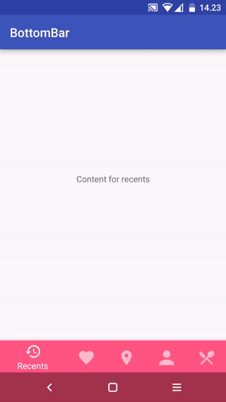

# BottomBar使用
---
开源地址：[https://github.com/roughike/BottomBar](https://github.com/roughike/BottomBar)

# 运行效果

## 使用步骤

### 1. 在Module的build.gradle添加依赖

	compile 'com.roughike:bottom-bar:2.0.2'

### 2. 创建底部Tab的配置文件res/xml/bottombar_tabs.xml:
	<tabs>
	    <tab
	        id="@+id/tab_favorites"
	        icon="@mipmap/ic_favorites"
	        title="Favorites"
	        barColorWhenSelected="#5D4037" />
	    <tab
	        id="@+id/tab_nearby"
	        icon="@mipmap/ic_nearby"
	        title="Nearby"
	        barColorWhenSelected="#7B1FA2" />
	    <tab
	        id="@+id/tab_friends"
	        icon="@mipmap/ic_friends"
	        title="Friends"
	        barColorWhenSelected="#FF5252" />
	</tabs>
> icon：Tab的图片，注意图片不能是透明的，不能存在padding, 可使用[Generic Icon Generator](https://romannurik.github.io/AndroidAssetStudio/icons-generic.html)生成，
> 选择“Trim”, Padding设置为0dp
> 
> barColorWhenSelected: 当Tab被选中时BottomBar的背景颜色

### 3. 在布局中添加BottomBar
	<?xml version="1.0" encoding="utf-8"?>
	<RelativeLayout xmlns:android="http://schemas.android.com/apk/res/android"
	                xmlns:app="http://schemas.android.com/apk/res-auto"
	                android:layout_width="match_parent"
	                android:layout_height="match_parent">
	
	    <!-- This could be your fragment container, or something -->
	    <FrameLayout
	        android:id="@+id/contentContainer"
	        android:layout_width="match_parent"
	        android:layout_height="match_parent"
	        android:layout_above="@+id/bottomBar"/>
	
	    <com.roughike.bottombar.BottomBar
	        android:id="@+id/bottomBar"
	        android:layout_width="match_parent"
	        android:layout_height="60dp"
	        android:layout_alignParentBottom="true"
	        app:bb_activeTabColor="@android:color/white"
	        app:bb_inActiveTabColor="@android:color/white"
	        app:bb_inActiveTabAlpha="0.3"
	        app:bb_tabXmlResource="@xml/bottombar_tabs"/>
	</RelativeLayout>

> bb_tabXmlResource: 指定BottomBar底部Tab的布局文件
> 
> bb_activeTabColor：设置选中Tab的文本颜色
> 
> bb_inActiveTabColor: 设置未选中Tab的文本颜色
> 
> bb_inActiveTabAlpha: 设置未选中Tab的文本透明度
> 
### 4. 设置点击监听
	
	public class MainActivity extends Activity {
	    @Override
	    protected void onCreate(@Nullable Bundle savedInstanceState) {
	        super.onCreate(savedInstanceState);
	        setContentView(R.layout.activity_main);
	
	        BottomBar bottomBar = (BottomBar) findViewById(R.id.bottomBar);
	        bottomBar.setOnTabSelectListener(new OnTabSelectListener() {
	            @Override
	            public void onTabSelected(@IdRes int tabId) {
	                if (tabId == R.id.tab_favorites) {
	                    // The tab with id R.id.tab_favorites was selected,
	                    // change your content accordingly.
	                }
	            }
	        });
	    }
	}

欢迎关注微信公众号

